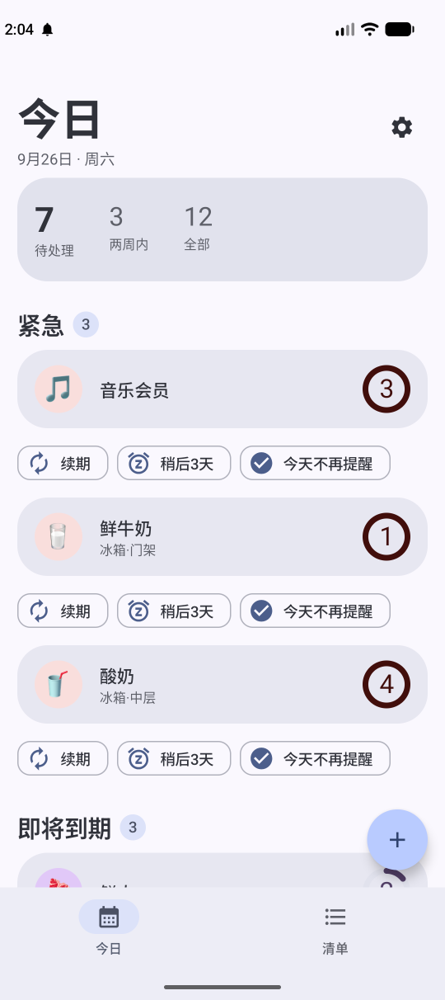
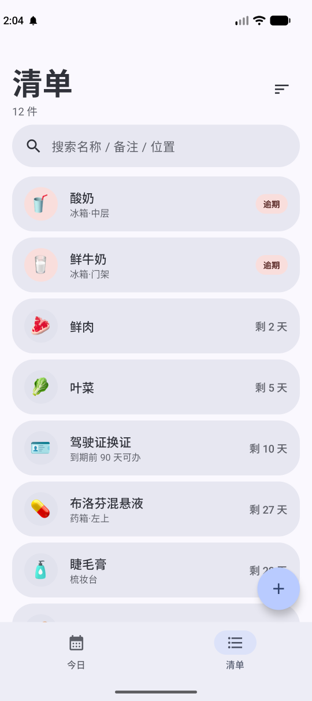
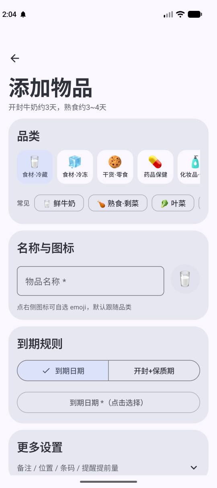
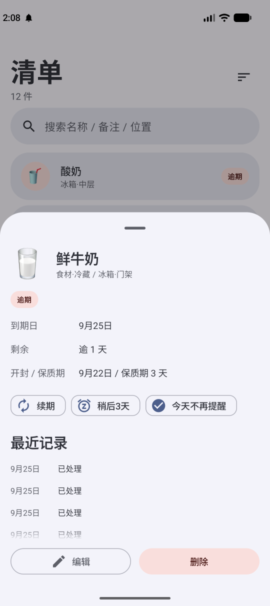
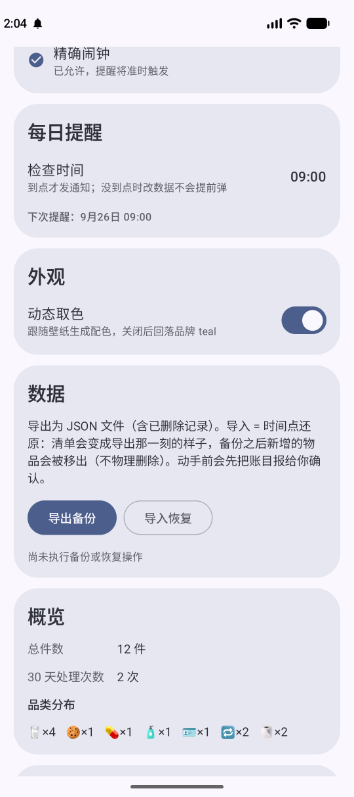
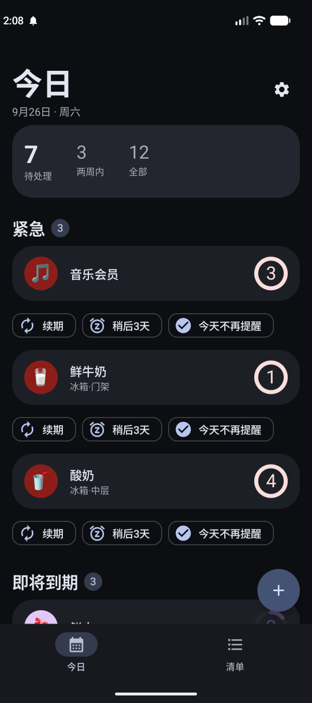

# 到期管家 · ExpiryKeeper

本机优先的家庭物品到期管家。食物、药品、化妆品、数码保修、证件、会员订阅，一处管理，到期前提醒。
没有账号、没有服务器、没有网络请求——数据只待在你自己手机上。

*Local-first household expiry tracker for Android. No account, no server, no network.*

## 界面

**今日** — 打开就知道今天要处理什么：待处理统计、按紧急程度分组，卡片下方直接给出续期 / 稍后 3 天 / 今天不再提醒。



**清单** — 全部物品一屏流水，逾期用胶囊标出，未到期显示剩余天数；支持按名称 / 备注 / 位置实时搜索。



**添加** — 选品类、点常见模板，两下就录完一条；副标题直接给出该品类的保质期常识。



**详情** — 状态、到期日、开封与保质期、最近 30 天的操作流水；编辑与删除钉在浮层底部，内容从它们下方滑过。



**设置** — 提醒权限自检、每日提醒时间、动态取色、导出与导入。导入前会先把账目摊开让你确认。



**暗色** — 同一套 tonal 层级，不是简单反色。



## 为什么做这个

冰箱深处的酸奶、药箱里开封半年的糖浆、忘了取消的会员——这类东西的共同点是**没人记着它就一定浪费**。

日历提醒不合适：物品不是事件，它没有"开始时间"，只有一个"该处理的日子"。备忘录也不合适：它不会主动找你。

所以这个 App 的取舍是：**把"物品"当一等公民**。一个 `reminderKind` 收敛掉所有提醒语义，录入压到两次点击，然后每天在你要看的时间点，把真正需要处理的东西推到眼前。

## 它能做什么

### 三种提醒语义

| 类型 | 语义 | 触发 |
|---|---|---|
| `EXPIRY` | 到期 / 过期 | 填到期日，或由**开封日 + 保质期天数**自动推导；逾期后每天提醒，并显示逾期了几天 |
| `CONSUMABLE` | 耗材余量 | 数量低于低库存线时提醒（洗衣液、纸巾、猫粮） |
| `RECURRING` | 周期扣费 | 续费前按提前量提醒；**扣费日一过转为「续费逾期」并每天提醒**，直到你续期或取消 |

### 常识库把录入成本压到两次点击

9 个内置品类、44 条常见物品模板，把"该填几天"这个最烦的问题变成一次点击：

```
鲜牛奶 3 天 · 鲜肉 2 天 · 叶菜 5 天 · 酸奶 14 天 · 鸡蛋 30 天
开封糖浆 / 眼药水 28 天 · 未开封药品 730 天
睫毛膏 / 眼线 180 天 · 面霜 12 个月
净水器滤芯 180 天 · 视频会员 30 天 · 证件到期前 90 天可办
```

模板**不落库**——物品不记得自己用过哪个模板，所以扩充常识库不改 schema、不碰迁移。

### 今日屏

- Hero 统计：待处理 / 两周内 / 全部
- 三个分组：**紧急**（逾期、今天到期、续费逾期）、**即将到期**（1–14 天窗口）、**需要关注**（低库存、今天扣费）
- 每张卡片下方直接给出 **续期 / 稍后 3 天 / 今天不再提醒**，不进详情页就能处理完
- 到期环：逾期显示逾期几天并走满环，今天显示「今」，其余按窗口递减

### 通知

- 每日提醒时刻可调（默认 09:00），设置页直接显示"下次提醒：9月26日 09:00"
- 多条到期聚合为一条分组摘要；通知上带 **稍后 3 天** 动作，点完今日屏同步消失
- 到点之前不会发通知——包括 WorkManager 的 24 小时兜底扫描，避免出现"设了 20:30 却凌晨 3 点弹"
- 用精确闹钟（`SCHEDULE_EXACT_ALARM`）守时，WorkManager 只做兜底；设置页顶部实时显示两项权限是否到位

## 数据不会丢

自用工具丢数据等于白用，所以这块的规则比功能多：

- **软删除，永不物理删除。** 删除只是给 `deletedAt` 打一个时间戳，仍参与后续所有合并判断；详情页删除后有 Snackbar 可撤销。
- **备份 = 时间点还原。** 导入前先把账目摊开让你确认（写回几条、移出几件、移出的是哪些）；备份里没有的物品只打墓碑，不销毁；空备份直接拒绝。
- **导出携带墓碑**，所以"某件东西被删掉了"这个事实也进得了备份文件。
- **严格解析。** 备份文件里任何一行结构不对 → 整个文件丢弃，不做"尽力解析，能读多少算多少"。
- **迁移有测试。** Room 1→2 迁移用 `MigrationTestHelper` 在设备上跑，断言行数与内容不变；没有开 `fallbackToDestructiveMigration`，schema 不匹配会失败而不是悄悄清库。
- **申请三个权限，就这三个。** `POST_NOTIFICATIONS`、`SCHEDULE_EXACT_ALARM`、`RECEIVE_BOOT_COMPLETED`——`AndroidManifest.xml` 里没有 `INTERNET`，数据只在本机 Room 数据库与你自己选的那个文件之间来回。

## 技术实现

```
Kotlin 2.3.21（由 AGP 9 内置工具链编译，不额外挂 kotlin-android 插件）
Jetpack Compose + Material 3 1.4（Compose BOM 2026.09.00）
Room 2.8.5 + KSP · WorkManager 2.11.2
compileSdk 37 / targetSdk 37 / minSdk 29
单模块 :app，40 个主源文件 + 8 个测试文件
```

分层是硬约束：

```
core/data         Room 实体、DAO、Repository、偏好
core/domain       纯函数：提醒引擎、表单状态、备份格式、恢复计划、日期文案
core/ui           设计系统（卡片、状态胶囊、区块头、快速操作、排版、配色）
feature/*         今日 / 清单 / 添加编辑 / 详情浮层 / 设置
notifications     渠道、聚合、精确闹钟 + WorkManager 兜底
```

`core/domain` 不依赖 Android，所以提醒规则、日期格式、备份解析、恢复计划全部在 JVM 上跑单测——一条规则改错了，`./gradlew test` 就会红，不需要连设备。

状态管理走 Room `Flow` → ViewModel → Compose 单向数据流；物品详情浮层用 `observeById` 实时流，别处改了会立刻反映到当前浮层。

## 构建

需要 Android Studio 或 JBR，以及 Android SDK 37。

```bash
./gradlew assembleDebug                 # Windows 上为 ./gradlew.bat
./gradlew testDebugUnitTest lintDebug   # JVM 单测 + lint
```

## 许可证

个人自用项目，暂未选择开源许可证。如需使用请先联系仓库所有者。
